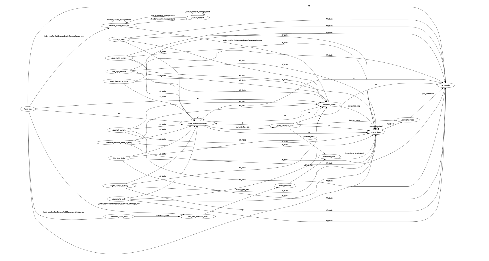

# TUM Introduction to ROS: Autonomous Driving

## ⭐️ Description and Task
This repo aims to develop a software that can navigate an autonomous vehicle in city environments. 


## ⭐️ Members
* Jingyi He
* Xinhua Wang
* Wenjie Xie
* Dian Yu
* Lingyue Zhao


## 💡 Prerequisites and Running

* Ubuntu 20.04
* ROS Noetic

Being in the main folder of your catkin workspace:
```shell
git clone https://gitlab.lrz.de/i2ros_team16/ros24_ss.git
```
Download the unity environment `AutonomousDriving.zip` from [here](https://syncandshare.lrz.de/getlink/fiLvgiTXetubiN1i4PRjuR/) and extract into `src/simulation`.

Extra packages need to be installed for running the program.
```shell
sudo apt install ros-${ROS_DISTRO}-octomap-rviz-plugins ros-${ROS_DISTRO}-octomap-server
sudo apt-get install ros-noetic-teb-local-planner ros-noetic-smach-ros
```

Additionally, we use [Segmentation Models](https://github.com/qubvel-org/segmentation_models.pytorch.git) as semantic backend. Additional commands should be executed.

```shell
sudo pip install segmentation_models_pytorch
```

After installation, build the project
```shell
catkin build
source devel/setup.bash
```
Then launch simulation
```shell
roslaunch simulation simulation.launch
```


### 
# Result Presentation
Traffic Light Detection: [demo_video_2.mp4]

Video: [demo video.mp4]

Report: [report.png](./docs/Report.png)
# Rosgraph



# Task
[x] Successfully working perception pipeline

[x] Successfully working path planning

[x] Successfully working trajectory planning

[x] Successfully avoiding other cars

[x] Successfully stopping at street lights

[x] Time to complete the mission: 280s

[x] Solving the problem without using semantic camera: ResNet 34 + Feature Pyramid Network(FPN)

[x] Own Msg: perception_msgs/LightState.msg

[x] Successfully adding state estimator to mitigate measurement noise
# 💡 Modules
## Perception
This module first projects the depth image onto a 3D point cloud. The point clouds from the depth cameras are then used to generate an OctoMap, which is subsequently projected into a 2D map. The 2D map is used by the planning module for obstacle avoidance.

The second part of the Perception module equips the vehicle with the ability to detect red traffic lights using a segmentation model trained by ourselves.
### Dependencies
- Octomap: A package which can get the occupancy Voxels and projected map from 3D point cloud data.
- Segmentation Models Pytorch(Open-Source library): Python library with Neural Networks for Image Segmentation based on PyTorch.
- Depth_image_proc: A package to convert the depth image data to 3D point cloud data.
### Nodes:
  - /semantic_cloud_node
  (Receive the RGB imgae from RGB Cameras and then publish semantic images Topic via Segmentation Model)

  - /red_light_detector
  (Detect and publish state of traffic light to State Machine)
   
  - /octomap_server 
  (Generate OctoMap and 2d map from Depth point clouds)


### Topics:
- /traffic_light_state
- /semantic_image
- /octomap_full
- /octomap_binary
- /projected_map
- /occupied_cells_vis_array
- /octomap_point_cloud_centers


### Octomap_mapping package:
Mapping tools to be used with the OctoMap library, implementing a 3D occupancy grid mapping.
- original author: Armin Hornung
- original source: [octomap_mapping](http://wiki.ros.org/octomap_mapping)

### Msg

LightState: 

- `bool`  is_stop


## Planning
Planning generates commands indicating the velocity of the vehicle. It plans the trajectory that avoids colliding with the environment which is constructed during the perception.

### Dependencies
  - move_base
  - teb_local_planner


### Nodes
  - /move_base (making global and local trajectories, transform trajectory into velocity commands)
  - /waypoint_node (instruct the next-to-go position to the planner to generate path)

### Topics
  - /cmd_vel
  - /base_planner_simple/goal


## Control
This node receives command velocity from `move_base planner`, and transform the cmd_vel twist into ackermann command. 

### Nodes
 - /controller_node (transform w-space command to acceleration, braking and steering angle)
  
### Topics
  - cmd_vel
  - car_command


## State Machine
We implemented a `finite state machine` based on smach, which is a ros package that provides fast prototyping of FSM. The transition is as shown in table.

### Dependencies
  - smach

### Nodes
  - state_machine
  
### Topics
  - /drive_state
